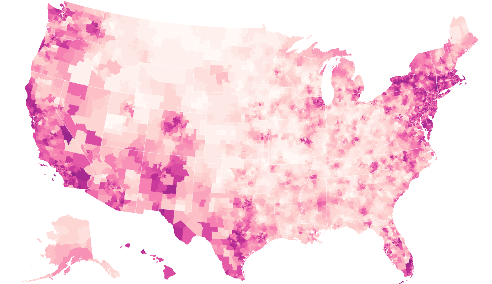
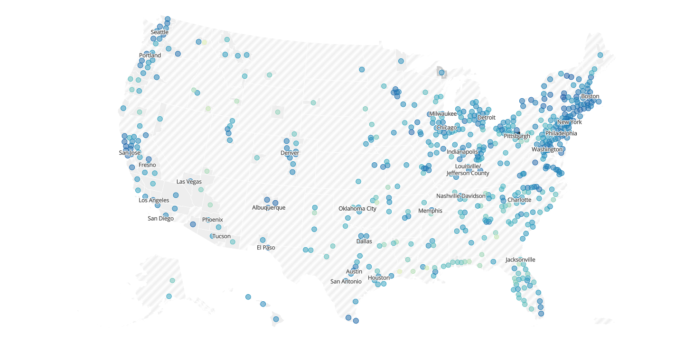

# Flatiron Module 3 Project
Our project for Module 3 in the Data Science Online Immersive Program at the Flatiron School

## Project Members
- Joseph Marx
- Steven Yan

## Instructional Team
- Fangfang Lee
- Justin Tannenbaum

## Background:
We definitely were data-driven in our efforts to clarify a project idea that encompassed both of our varied interests.  We started off from the COVID-19 dataset and looking at all the different aspects of society that COVID impacted that range from issues such as governance (i.e. declarations of state of emergencies and lockdowns), race (i.e. racial disparities in cases and deaths, access to healthcare and testing), economy (i.e. impact on food supply, impact on manfucturing, education, service, hospitality due to social distancing), public health measures (i.e. mask mandates, testing and contact tracing, vaccination rollout).  Each of these aspects can be explored on an international, national, state, and/or a county level depending on the availability of information, which is generally motivated by studies due to funding.  For the most part, due to the urgency of the issue and panglobal impact of the virus, it is in every nation's to share information.

As we sifted through the different datasets, we stumbled upon a mask wearing study conducted by New York Times. The image below illustrates what the data is able to demonstrate, which is by county an estimate of the likelihood you would encounter someone wearing a mask in the next 5 encounters based on a survey conducted back in July:

While this dataset provides data on every county in the United States, his dataset only provides a snapshot at one very specific time of every county in the United States.  There is an ongoing study conducted by Carnegie Mellon facilitated by Facebook that captures data from the subset of individuals tthat use Facebook as a social platform, but also would be willing to complete a survey about COVID-19.

## Business Proposal:

## Notebook Structure:
- 

## Folder Structure:
- [images/]: Folder containing visualizations
- [data/]: Folder containing 2020 election data, county data, and shape files for visualizations
- <Phase_3_Project.ipynb>: Notebook for Data Cleaning, Exploratory Data Analysis, Feature Engineering, and Feature Selection
- <the_masked_politician.ipynb>:  Notebook for Feature Selection, Modeling, and Data Analysis
- <Presentation.pptx>: Powerpoint for Presentation to Cohorts
